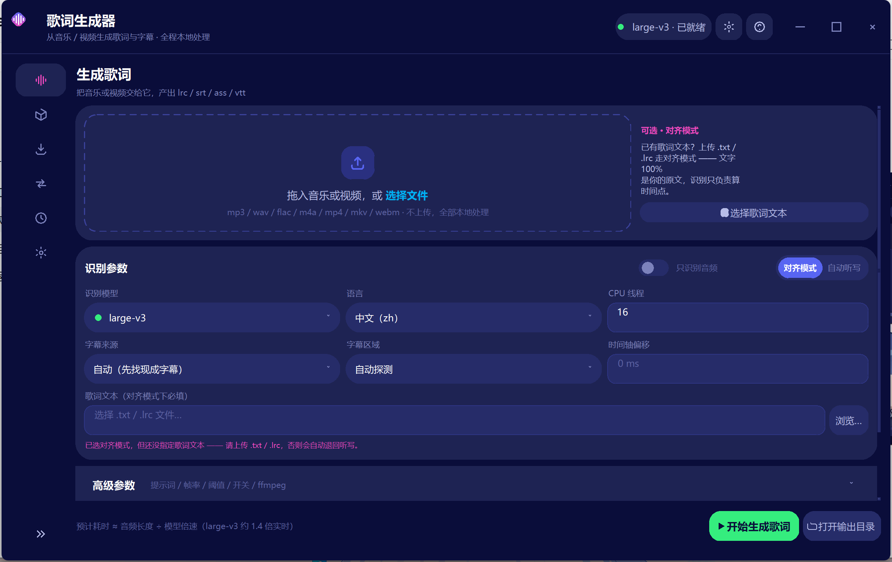

# 歌词生成器 — 从音乐/视频生成歌词与字幕

优先取视频里**现成的字幕**（内嵌字幕轨 / 外挂字幕文件 / 画面硬字幕 OCR），取不到才用本地语音识别。
不联网、不上传任何音频。可输出 `.lrc`（默认，网易云等播放器通用）、`.srt`、`.ass`/`.ssa`、`.vtt`。

---

## 快速开始

**双击 `start.bat` 就行。** 这是唯一入口 —— 字幕识别和音频识别两条路都在它后面，
它会自己检查并补齐缺的东西：

| 它会做什么 | 说明 |
|---|---|
| 找一个 Python 3.9+ | 找不到会明确告诉你去装 |
| 缺主依赖就装 | 约 150MB，走清华源 |
| 缺模型就下 | 自动下 `small`（480MB） |
| 启动图形界面 | 界面里能选字幕源、输出格式、模型、区域等 |
| 缺 OCR 依赖时提示 | 画面硬字幕识别靠它（可选，约 17MB，不会阻塞启动） |

也可以把**音视频文件直接拖到 `start.bat` 上**，跳过界面直接出 `.lrc`。
所有参数原样转给引擎：

```bat
rem 默认：先找现成字幕，取不到再语音识别
start.bat "D:\某首.mp3"

rem 只识别画面上的硬字幕
start.bat "D:\某视频.mp4" --subs ocr

rem 只用现成字幕（内嵌轨 / 外挂文件），秒出
start.bat "D:\某视频.mkv" --subs track

rem 不用字幕，纯语音识别
start.bat "D:\某视频.mp4" --subs off

rem 输出格式：默认 lrc，可换成 srt / ass / ssa / vtt
start.bat "D:\某视频.mkv" --subs track --format srt
```

想先把依赖和模型一次备齐、以后再启动就秒开：

```bat
start.bat --setup
```

其他常用开关：

| 命令 | 说明 |
|---|---|
| `start.bat --install-ocr` | 单独装画面硬字幕 OCR 依赖（约 17MB） |
| `start.bat --get-model` | 列出全部模型与下载状态 |
| `start.bat --get-model large-v3` | 单独下某个模型（中文质量最好） |
| `start.bat --help` | 显示引擎的完整参数表 |

**整个文件夹只有两个程序文件**：`start.bat`（启动器，负责环境准备）和 `lyric_maker.py`
（引擎，所有功能都在里面）。不再有 install_deps / install_ocr / download_model / run_gui 这些散落的脚本。

---

## 从视频里取字幕（比语音识别准得多）

视频里常常**本来就有歌词**，那是最准的文字来源——没必要让语音识别去猜。
工具默认会先找字幕，按下面的优先级走：

| 顺序 | 来源 | 速度与准确度 |
|---|---|---|
| 1 | **内嵌字幕轨** | mkv/mp4 里的字幕流，ffmpeg 直接抽出来。**文字 100% 准确，秒级完成** |
| 2 | **同名外挂字幕** | 视频旁边的 `.srt` / `.ass` / `.ssa` / `.vtt` / `.lrc` |
| 3 | **画面硬字幕 OCR** | 字幕烧录在画面上（B站/YouTube 下载的视频基本都是这种）。需先跑 `start.bat --install-ocr` |
| 4 | 语音识别 | 前三条都没命中，才回到原来的听写/对齐流程 |

用 `--subs` 控制走哪条：

```bat
start.bat "视频.mkv"               rem 默认 auto：先找现成字幕，没有再 OCR
start.bat "视频.mkv" --subs track  rem 只用现成字幕，秒出，完全不 OCR
start.bat "视频.mp4" --subs ocr    rem 只做画面 OCR
start.bat "视频.mp4" --subs off    rem 不用字幕，纯语音识别
```

（也可以直接把文件拖到 `start.bat` 上，等价于不带 `--subs` 的第一种。）

### 硬字幕 OCR 是怎么做到不太慢的

朴素做法是逐帧 OCR 整部视频：4 分钟 1080p 有近 6000 帧，每帧几百毫秒就是几十分钟。这里拆成四步：

1. **自动定位字幕带**。抽查十几帧，缩到 640 宽后**只跑文字检测**（不认字，快约 3 倍），
   把检出文字的纵向范围按桶统计"出现帧数"。字幕几乎每帧都出现在同一高度，而标题、水印
   只偶尔出现，所以出现率最高的那条带就是字幕带。
   这一步是必需的：实测两个填词视频的歌词都在**画面正中**，固定按"底部"去找会一行都抓不到。
2. **只用帧间差异定位切换点**。字幕切换必然造成该区域像素突变，先用极便宜的灰度差分
   找出突变帧，只对突变帧做 OCR——几百帧里通常只有几十帧真正需要识别。
3. **起点细化**。粗扫的时间分辨率是 1/`--subs-fps`，再对每个新行在"上一个粗扫帧到本次粗扫帧"
   这一格窗口里用 10 fps 重扫，把起点误差压到 0.1 秒。
4. **文本去重**。背景运动造成的误报，会被"与上一行高度相似就不记"这条规则吃掉。

`--subs-region` 可以手动指定区域（`bottom` / `top` / `0.65,0.95`），跳过第 1 步能省十几秒。

#### 实测（i9-14900HX，纯 CPU，207 秒 1080p webm）

| 项目 | 结果 |
|---|---|
| 自动定位字幕带 | 约 17 秒（抽查 16 帧，只跑检测） |
| 主扫描抽帧 | 约 20 秒（415 帧） |
| OCR 与起点细化 | 约 10 分钟，共 400 余次 OCR |
| **端到端** | **约 11 分钟（≈0.31 倍实时）**，输出 65 行 |
| 自动定位结果 | 画面纵向 35%–65% —— 这个视频的字幕在**正中**，不在底部 |

识别准不准，取决于字幕长什么样。同一支视频里两种表现：

- 后半段的**普通白字字幕基本全对**
  —— `雄关漫道今尤在`、`九州五雷震荡`、`真金不惧火炼`、`待到星火东升 红旗遍山岗`
- 前半段那种**大号多色艺术字错得明显**
  —— `谁曾四渡赤水破万难` 被读成 `谁四渡亦水破万难`

**结论：规整的底部/居中白字，OCR 结果可以直接用；花哨艺术排版还是走对齐模式更省事。**

调参记录（同一支视频，端到端耗时）：未指定 OCR 线程 22 分钟 → 指定 16 线程 + 起点细化降到 6fps + 相邻行合并，**11 分钟**。
OCR 线程数不是越多越好：实测 16 线程最快（0.94s/帧），加到 24 线程再开 mkldnn 反而回到 1.42s。

---

## 两种模式（**关键**）

> 这一节讲的是"前面几条字幕来源都没命中、只能用语音识别"时的两种做法。
> 只要视频里能拿到字幕，就优先用上面那一节的 `--subs` —— 准确度和速度都不是一个量级。

### 模式一：自动听写（`--lyrics-file` 不传）

工具自己听，自己写字。适合**人声清晰的口播/访谈/视频**。

```
start.bat "讲座.mp4" --model large-v3 --vad
```

⚠️ **对"歌曲"效果有限，这是原理决定的，不是 bug。** 歌唱的元音拖长、音高变化、伴奏掩蔽，
会让任何语音识别模型输出"听着像但字不对"的结果。实测 `small` 模型听写一首中文歌曲，
大量句子是谐音乱码。换更大的模型会好一些，但不可能根治。

### 模式二：对齐模式（推荐，`--lyrics-file` 传歌词文本）

**你提供正确歌词文本，工具只负责算出每句的精确时间点。** 文字 100% 是你的原文，
零错字；识别结果仅用作时间锚点。只要歌词和音频是同一首歌，产出的 LRC 就是可用的成品。

```
start.bat "歌曲.mp3" --lyrics-file "歌词.txt" --model small
```

- 歌词文件支持 `.txt` / `.lrc`，编码自动识别（UTF-8 / GBK / UTF-16 都行）
- 已经带时间戳的 `.lrc` 也能直接喂进来，时间戳会被剥掉重新对齐
- 歌词里多余的空行、`[ti:]` 之类的元数据行、行首序号都会被自动清理

**对齐算法的可靠性（有测试支撑）。** 内置自检用合成数据验证，并专门构造了对抗场景：

| 场景 | 结果 |
|---|---|
| 干净数据（已知真值 + 15% 字符错误 + 随机插入杂字） | 最大误差 **0.35 秒** |
| **对抗场景**：某行在音频里识别失败，但同一句在后方副歌里重复出现 | 偏差 **0.00 秒**（老算法会被拖到副歌位置，偏十几秒） |
| 真实歌曲实测：相邻行的最小间隔 | 老算法 **0.04 秒**（多行被压成一团）→ 新算法 **2.24 秒** |

对抗场景是实测踩出来的真实 bug：最初我按"该行第一个匹配到的字符"取锚点，结果某行首字
恰好在很远的副歌里命中，整行被拖偏 13 秒。修法是三层稳健化 —— 锚点覆盖度门槛、
与单调趋势严重不符的离群锚点迭代剔除、以及时间没前进的锚点直接丢弃后折线插值。

`python lyric_maker.py --selftest` 可以随时自己跑这 89 项检查。

---

## 图形界面

双击 `lyric-maker.exe`（或 `start.bat`）就进界面。深色主题，左侧竖排导航，六个页面：

**高分屏（2K / 4K）**：程序已声明 DPI 感知，界面按显示器的真实像素渲染，文字和描边都是清晰的
（早期版本是 DPI-unaware，Windows 把整个窗口画成小位图再放大，在高分辨率屏上会发糊）。
窗口尺寸、控件间距、圆角、图标、下拉弹层都会跟着系统缩放比例等比放大，**看起来和低分屏
一样大**，只是更清晰。系统缩放比例变了，下次启动会自动按新比例重排。

| 页面 | 干什么 |
|---|---|
| **生成歌词** | 拖入或选文件 → 调参数 → 出字幕。跑起来之后这一页会变成进度条 + 实时日志 |
| **模型管理** | 六个模型的下载 / 删除，自带断点续传。不用再开命令行敲 `--get-model` |
| **视频下载** | 内置 yt-dlp，粘贴链接直接下。**不用控制台、不用另外装 yt-dlp** |
| **格式转换** | 视频 / 音频互转：17 种常用格式，可批量排队，能只转封装不重编码 |
| **历史记录** | 每次生成自动记一条，可以按文件名搜、一键重跑 |
| **设置** | 默认模型 / 语言 / 格式 / 输出目录 / 线程数 / 各种开关 |

**模型选择会跟着 `models/` 目录走。** 「识别模型」下拉里每个模型都带状态：

- 已下载的标绿色「已下载」，未下载的标蓝色「下载」；
- 点那个「下载」就直接开始下载，**下完自动落进 `models/` 目录**，不用手动搬文件；
- 如果当前选中的是个没下载的模型，底部主按钮会从【开始生成歌词】变成
  **【下载并继续】** —— 点它，下载完成后自动开始生成，中间不用你手动再点一次。

也就是说，你手册里丢进 `models/` 的新模型，界面能直接认出来；列表里的其余模型
点一下就能补齐，全程不用碰命令行。

### 窗口操作（拖动 / 最大化 / 贴边吸附）

标题栏是自绘的（原生标题栏被摘掉），所以这几个动作都由程序自己接管：

| 操作 | 效果 |
|---|---|
| 拖顶栏空白处 | 移动窗口 |
| 双击顶栏 | 最大化 / 还原 |
| **拖到屏幕顶边** | **自动最大化** |
| **拖到屏幕左 / 右边缘** | **自动占半屏** |
| 从吸附位再拖开 | 还原成吸附前的大小，并跟着光标继续走 |
| 最大化后往下拖 | 先还原，再跟着光标走（轻点一下不会误还原） |
| 拖右下角 | 自由缩放 |

吸附的判据是**光标**离屏幕边缘的距离（`SNAP_EDGE`，默认 8 逻辑像素），和系统的贴边行为
一致：手把窗口甩到边上就吸附。半屏同样按边框留白外扩，保证内容正好占半屏、四边不露缝。

**最大化/还原/半屏都带过渡**，实测一次 ~220–280ms（系统自带动画是 200ms 量级）。
这一步是必要的：Tk 改一次窗口尺寸要 ~330ms，其中排版只占 5.6ms、剩下全是重绘，
直接跳变的话会先露出背景色、再看着控件一个个长出来。所以流程是
**淡出 → 挪到屏幕外按新尺寸排版（不重绘，5ms）→ 挪回来一次画完 → 淡入**，
中间那段没画完的过程是看不见的。逐帧缩放动画做不了：Tk 每帧都是整窗重排，
8 帧就是 2.1 秒。

> 之所以不用系统自带的贴边：`WM_NCLBUTTONDOWN(HTCAPTION)` 是同步消息，拖动期间 Tk 的
> mainloop 完全停摆（表现就是「一拖窗口程序就没反应」），而且它会在这个无框窗口上触发
> `SW_MAXIMIZE` 把进程卡死。现在位移全靠 `SetWindowPos` 自己算，贴边也自己补了一份。

### 视频下载（内置 yt-dlp）

「视频下载」页把 yt-dlp 的 **Python API** 直接嵌进程序，所以**下载视频不用再开控制台、
也不用另外装 yt-dlp**。用 API 而不是调命令行，是为了拿到结构化的进度 / 速度 / 剩余时间，
而不是去解析控制台文本。

- **解析**：粘贴链接点【解析】，先看标题、时长、可用格式再决定要不要下。
  播放列表会显示条目数。
- **自动识别可用清晰度**：解析完会把画质下拉换成**这个链接真实有的**档位
  （比如 `最高 2160p / 1440p / 1080p / 720p`），而不是写死几档 —— 链接有什么就能下什么，
  还带「仅音频（m4a）」。
- **不转码**：容器默认「不转码（原始）」，也可以强制 mp4 / mkv / webm。
- **直接粘贴（Ctrl+V）**：在**页面任何位置**按 <kbd>Ctrl</kbd>+<kbd>V</kbd> 都行
  （不用先点输入框），或点【粘贴】按钮。
  - **不用先整理剪贴板** —— 从浏览器/分享按钮复制的往往是整段文案
    （`【标题】 https://... 快来观看`），程序会**自动把链接挑出来**填进输入框，
    不会把整段丢给 yt-dlp 然后报"Unsupported URL"。
  - **只填不解析** —— 贴完链接会停在输入框里等你确认，**必须点【解析】**才会去请求网络。
    想改一改再解析也来得及。
  - **一次粘多个也行** —— 粘一串链接会排成队列，下完一个自动下一个，
    不用守着点【开始下载】。
- **画质 / 容器**：最佳、最高 1080p/720p/480p、仅音频（m4a）；容器可自动合并或强制
  mp4 / mkv。合流和转码需要 ffmpeg —— 程序本身已经会找 ffmpeg，找不到就只给单文件。
- **进度 / 取消**：底部进度条 + 速度 + 剩余时间，随时可点【取消】。
- **默认输出到 `out/downloads/`**，可以在页面上改。

#### Cookie 与登录态

会员、年龄限制、地区限制的视频需要登录态。Cookie 有两条路，都在页面上：

| 方式 | 说明 |
|---|---|
| 读浏览器 Cookie | 下拉里选 Chrome / Edge / Firefox / Brave / Opera。**只在内存里用，不落盘**；页面上会直接告诉你这个浏览器「已就绪」还是「未检测到」 |
| 手动导出 | 把 cookie 文件放进 **Cookie 文件夹**（默认 `cookies/`），程序启动时自动创建，放进去就生效 |

**扫描范围 = 只在 Cookie 文件夹（`cookies/`），全部 `.txt` 里取最新的那一份**

程序**只**扫描 Cookie 文件夹（默认 `cookies/`），不碰主文件夹，规则简单：
这里放什么就用什么。

- **内容判定，不看名字**：认 `Netscape HTTP Cookie File` 文件头，或"≥7 个制表符分隔
  字段且名/值非空"的结构。所以一个制表符分隔的通讯录、或随便写的 `notes.txt`
  不会被误当成 cookie 文件。
- **只用最新的那份**：当文件夹里有多个合法 `.txt` 时，**按文件修改时间取最新的一个**
  交给 yt-dlp，其余较旧的不会被使用。原因：同一账号在不同时间导出的多份里，
  越新的越可能还有效，旧的早被 YouTube 轮换掉了；与其把所有（含失效的）都塞进去，
  不如直接用最新的那份。状态行会注明「已加载 xxx（另有 N 个较旧的 .txt 未用）」。
- 不想用某份时，删掉或移走它即可——没有任何自动合并、没有任何中间文件。

实测遇到过导出成 `cookies .txt`（`.txt` 前多一个空格）的情况 —— 按内容认，装什么名字都行。

**两条路不会互相打架**：只要找到了可用的 cookie 文件，程序就**只用文件、
不再去读浏览器**。因为浏览器那步失败会直接抛 `CookieLoadError` 把整个解析打断
（Chrome/Edge 在运行时必失败），而你已经给了可靠的文件。状态行会写明
「已优先用文件，忽略浏览器 Cookie」。

**文件在、却读不到**时会直接点名：状态行会显示
`xxx.txt 不是有效的 cookie 文件（需要 Netscape 格式）`，而不是让你对着
yt-dlp 的 `failed to load cookies` 发呆。

**Cookie 文件夹可以改**：页面上那个路径框旁边有 **【更改…】**（换一个位置，比如放到同步盘上）
和 **【打开】**（在资源管理器里打开）。默认是 `exe 所在目录\cookies`，
改动会记进 `settings.json`，下次启动沿用；目录不存在会自动创建。
状态行会显示当前生效的目录，改完立刻能看到有没有读到 `cookies.txt`。

浏览器 Cookie 读不到时（没装、没登录、或新版 Chrome 的加密限制），用手动导出的
`cookies.txt` 最稳。

> **实测提醒（2026-10）**：YouTube 现在会对未登录请求返回
> `Sign in to confirm you're not a bot`。此时 `--cookies-from-browser` 也常常失败：
> Chrome 会报 `Could not copy Chrome cookie database`（浏览器正在运行 / 数据库被占用），
> Edge 会报 `Failed to decrypt with DPAPI`（Chromium 的 App-Bound Encryption，
> yt-dlp 无法解密）。**最可靠的办法是手动导出 `cookies.txt` 放进 Cookie 文件夹**：
> 用浏览器扩展（如 "Get cookies.txt LOCALLY"）在已登录 YouTube 的状态下导出，
> 放进文件夹即自动生效。

#### YouTube 的「n 参数」挑战（JS 运行时）

2026 年起 YouTube 还会下发 `n 参数` 挑战，不解开就只给少数低清格式
（日志里是 `n challenge solving failed`）。解它需要两样东西，**程序已自动处理**：

| 需要 | 本程序怎么做的 |
|---|---|
| yt-dlp-ejs 求解器脚本 | 已随程序打包（源码模式由 `start.bat` 装到 `.deps-ejs/`） |
| 一个 JS 运行时 | **自动探测** `deno` → `node` → `nodejs` → `bun` → `qjs`，找到就喂给 yt-dlp |

页面的状态行会显示 `JS 运行时 node` 或 `缺少 JS 运行时` —— 后者不是错误，
只是 YouTube 会只给低清格式。想拿到高清就装一个 [Deno](https://deno.com/)（yt-dlp 官方默认支持）
或 Node.js 即可，装完重启程序自动认。

> 另一个坑：某些工具会往环境变量里塞 `NODE_OPTIONS=--require=...`。
> yt-dlp 起 node 子进程时会**继承**它，一旦那个注入的脚本限制了文件读取，
> 求解器就读不到自己的 JS 文件（报 `Access to this API has been restricted`），
> 表现成"n challenge 解不开"，但真凶跟 yt-dlp 无关。程序会在建 yt-dlp 参数前
> 清掉 `NODE_OPTIONS` / `NODE_PATH`，避开这类干扰。

### 格式转换

「格式转换」页把 ffmpeg 包进界面，**一次可以选多个文件排队转**，常用的视频和音频格式都在下拉里。

**支持的格式（17 种）**

| 类型 | 格式 | 编码 |
|---|---|---|
| 视频 | MP4 / MKV / MOV / M4V / TS / FLV | H.264 + AAC |
| 视频 | AVI | MPEG-4 + MP3 |
| 视频 | WebM | VP9 + Opus |
| 视频 | WMV | WMV2 + WMA |
| 音频 | MP3 / M4A / AAC / OGG / Opus / WMA | 对应有损编码 |
| 音频 | FLAC / WAV | **无损**（不设码率） |

转成音频时会**丢掉画面只留声音**；FLAC / WAV 是无损的，所以不套码率设置。

**三种用法**

- **重编码（默认）**：画面和声音都重新编码。视频目标给「高画质 / 标准 / 高压缩」三档
  （对应 CRF 18 / 23 / 28），音频目标给 320 / 256 / 192 / 128 kbps 四档。
- **仅转封装**：打开开关后走 `-c copy`，**不重新编码** —— 速度极快且画质无损，
  但要求原文件的编码被目标容器支持（比如 H.264 的 mp4 转 mkv 可以，反过来不一定）。
  不支持时会明确报错，并告诉你原因。
- **批量**：一次选多个文件按顺序转，进度条走的是**整批**的量，不是单个文件的。

**「输出预览」**会把当前设置到底会产出什么摊成一排彩色标签（画面编码 / 声音编码 / CRF / 码率），
不用去猜「标准」具体是多少。**运行日志默认是收起来的**（点标题栏展开），开始转换时会自动展开，
失败时也会自动展开 —— 平时不占地方，出事时第一眼就能看到原因。

转换中途可以点【取消】，会立刻杀掉 ffmpeg 进程，并把写了一半的坏文件清掉。
转失败时**原因会写进 `lyric-maker.log`**，不用再开命令行复现。

#### 只识别音频（生成歌词页）

生成页「识别参数」标题行右侧有个 **【只识别音频】** 开关：

- 打开后**跳过视频字幕提取与画面 OCR**，只用声音识别生成歌词 —— 最准也最快的那条路；
- 打开时会锁住「字幕来源」（等价于设为 只识别音频），关掉会**还原你原来的设置**；
- 拖入**纯音频文件**（mp3/wav/flac…）时会**自动打开** —— 音频文件本来就没有视频字幕可提。

#### 下载不动？先跑自检

程序内置一条诊断命令，会把下载链路每一环的状态打出来：

```
lyric-maker.exe --dl-test "https://youtu.be/xxxx"
```

输出里能看到 yt-dlp 版本、JS 运行时、求解器、Cookie 文件、代理环境变量，
以及这条链接到底解析得出什么（标题 / 时长 / **该视频真实可用的清晰度**）。
卡在哪一环一目了然。（打包版没有控制台，输出会写进 exe 旁边的 `lyric-maker.log`。）

#### 依赖从哪来

- **打包版**：yt-dlp 已经打进 exe，用户什么都不用装。
- **源码模式**：`start.bat` 首次运行会自动装到 `.deps-ytdlp/`（约 20 MB）。
  装不上也不影响其它功能，只是下载页会提示"未内置 yt-dlp"。



**几个值得知道的点**

- **模式是自动判定的**：给了歌词文本就是**对齐模式**，没给就是**自动听写**。
  界面上那个"对齐模式 / 自动听写"分段控件只是把这件事显式说出来 ——
  如果你选了对齐模式却忘了传歌词，它会当场变红提醒你。
- **参数填一次就记住**。点【开始生成歌词】时会把这次的参数写成新的默认值，
  下次打开还是这一套，不用反复填。想回出厂值点【设置 → 恢复默认】。
- **日志同时落盘**。界面里的日志和 exe 旁边的 `lyric-maker.log` 是同一份内容，
  出问题时把那个文件发出来就够了。
- **窗口最小 1024 × 680**，再小信息就不完整了，所以在系统层锁住不让你继续缩；
  窗口宽度小于 1200 时左侧导航会自动收成图标轨道，把宽度让给内容。
- 宽窗口下 6 个参数排成 3 列，窄窗口自动变 2 列。**界面不会出现横向滚动条。**
- **语言不用下载**。「语言」下拉里有中/英/日/韩/法/西/德/俄/葡/意/泰/越 等常用语种，
  选哪个是告诉模型"按这个语言识别"。这些能力都内置在多语种模型里（`large-v3`、`small`
  等多语种模型都支持），**不需要任何单独的"语言包下载"**；列表长了会自动带滚动条。

界面会在 exe 旁边写自己的数据文件，都是本地的，可以直接删。**历史记录单独收在
`data/` 子文件夹里**，免得主目录堆一堆散 JSON：

| 文件 | 内容 |
|---|---|
| `data/history.json` | 历史记录（最多保留最近 200 条） |
| `settings.json` | 上次用的参数 |

`data/` 文件夹在软件启动时自动创建。历史记录页的底部和空状态页都会显示它的完整路径，
想备份或直接翻记录，复制这个文件夹走就行。

> 从旧版本升级过来时，主目录里那个旧的 `history.json` 会在首次运行时**自动搬进
> `data/`**，记录不会丢。搬家前会先完整校验一遍：文件损坏就留在原地不动 ——
> 宁可让用户自己处理，也不能因为搬家把记录弄丢。

**拖放是可选能力。** 装了 `tkinterdnd2` 就能把文件直接拖进窗口：

```bat
python -m pip install --target .deps tkinterdnd2
```

没装也不影响别的 —— 点【选择文件】一样用，只是不能拖。

---

## 命令行参数

> **本机注意：`python` 不在 PATH 里**，而且 `py` 启动器指向一个已损坏的 Python 3.7，
> 所以下面示例里的 `python` **不能直接用**。用 `start.bat` 代进去就行，
> 它自己会找到正确的解释器，参数原样转发：
>
> ```bat
> cd /d D:\A\lyric-maker
> start.bat "D:\A\某首歌.webm" --lyrics-file "D:\A\歌词.txt"
> ```
>
> 也可以直接把文件拖到 `start.bat` 上（等价于只传文件、不加任何选项）。
> 下面的示例为了简洁仍写作 `python`，实际请用 `start.bat`。

```
start.bat <音视频文件> [选项]

  --model NAME      模型名或模型目录，默认 medium
                    可选: tiny base small medium turbo large-v3
  --lyrics-file F   给出歌词文本 -> 进入对齐模式（强烈推荐用于歌曲）
                    传 .srt/.ass/.vtt/.lrc 等带时间戳的字幕时，直接用它的时间轴
  --subs MODE       字幕来源，默认 auto：
                      auto   先找现成字幕（内嵌轨 / 同目录外挂文件），没有再 OCR
                      track  只用现成字幕，秒级完成、文字 100% 准确
                      ocr    只识别画面上烧录的硬字幕
                      off    不用字幕，纯语音识别
  --subs-file F     显式指定字幕文件（.srt/.ass/.ssa/.vtt/.lrc）
  --subs-region R   硬字幕所在区域，默认 auto（自动探测字幕带）
                    也可写 bottom / top / 0.65,0.95（画面高度比例）
  --subs-fps N      硬字幕粗扫帧率，默认 2。时间精度不够可调到 3~4（更慢）
  --subs-no-refine  关闭硬字幕起点细化（快一点，行起始精度降到 1/subs-fps 秒）
  --subs-min-score  OCR 置信度阈值，默认 0.5。误识别多就调高
  --language L      zh(默认) / en / ja / ko / auto
  --out PATH        输出路径，默认与输入文件同名同目录
  --format F        输出格式，默认 lrc：lrc / srt / ass / ssa / vtt
                    不给的话也能用 --out 的扩展名指定，比如 --out 字幕.srt 自动出 srt
  --prompt TEXT     初始提示词，可引导用词、标点、简繁
  --vad             开启语音活动检测。口播/视频建议开；歌曲建议关（默认关）
  --threads N       CPU 线程数，默认 min(16, 核心数)
  --start S         只处理从第 S 秒开始
  --duration S      只处理 S 秒（快速试听效果用）
  --offset MS       时间轴整体平移毫秒
  --no-split        不按标点拆分过长行
  --no-merge        不合并过短的相邻段
  --keep-wav        保留中间 WAV 便于排查
  --gui             启动图形界面
  --selftest        运行内置自检（不需要音频）
```

### 模型选择

| 模型 | 大小 | 源 | 建议 |
|---|---|---|---|
| `small` | 480 MB | hf-mirror | 流程验证、对齐模式的锚点够用 |
| `turbo` | 1.6 GB | hf-mirror | 速度与质量折中 |
| `large-v3` | 2.9 GB | **ModelScope** | 质量最好，中文首选 |

```
python lyric_maker.py --get-model              # 列出全部模型与状态
python lyric_maker.py --get-model small
python lyric_maker.py --get-model large-v3
```

---

## 实测性能（本机 i9-14900HX，CPU int8，16 线程）

以一首 3 分 45 秒的 mp3 为例：

| 项目 | 结果 |
|---|---|
| 解码 + 载入 | 约 1 秒 |
| 识别（`small`） | 24.5 秒 → **约 9.2 倍实时速度** |
| 端到端 | 27.5 秒 |
| 对齐模式时间误差 | 合成数据实测最大 **0.35 秒** |

CPU 上跑，完全不需要 GPU。（本机是 RTX 5060 Laptop / Blackwell sm_120，
需要 CUDA 12.8+ 才能用上，收益不值当，故一律走 CPU int8。）

### `small` vs `large-v3` 实测对比（同一首歌的第 60–120 秒，输入完全相同）

| 模型 | 耗时 | 速度 | 听写质量 |
|---|---|---|---|
| `small` | 9.6 秒 | **6.3 倍实时** | 谐音乱码多；且在 01:00–01:30 的**纯伴奏段幻觉出了整句** |
| `large-v3` | 43.2 秒 | **1.4 倍实时** | 明显更连贯，用词更像真句子；且**正确识别出伴奏段不出字** |

具体差异（两边都是错的，但错的程度不同）：

```
small     [01:00.00] 背后一回拥有了背后马脸足异歌无声音      ← 这一段其实没人唱
large-v3  （01:00–01:30 无输出，正确跳过）                  ← 分辨出了纯伴奏

small     [01:45.00] 说来说出海关毛巨星当初革命格的有点机会注意
large-v3  [01:45.52] 说来说去还怪毛主席当初革命歌队有点机会主义   ← 更接近真实
```

**结论：`large-v3` 明显更好，但仍然不能直接当歌词用。** 中文歌唱的听写是原理性难题，
不要指望换模型解决。**歌曲请一律用对齐模式**（`--lyrics-file`）：
文字 100% 是你的原文零错字，识别只用来提供时间锚点。
`large-v3` 也值得下，因为它的词级时间戳更准，对齐结果更稳。

---

## 实现要点（为什么这么写）

**为什么不直接用 faster-whisper 自带的音频解码。**
它内部走 PyAV，而本环境装到的 `av 19.0.1` 与 `faster_whisper 1.2.1` 的
`decode_audio(metadata_errors=...)` 调用不兼容，会直接抛
`open() got an unexpected keyword argument 'metadata_errors'`。
所以先用 ffmpeg 解码成 16kHz 单声道 WAV，再用标准库 `wave` + numpy 读成数组喂给
`transcribe()` —— 整段 PyAV 代码根本不执行，还省一次重复解码。

**反幻觉三件套。** Whisper 在伴奏/间奏段会陷入"重复上一句"的循环，所以：
`condition_on_previous_text=False`（最关键的开关）、幻觉黑名单正则
（"请不吝点赞/订阅/字幕由…提供"这类训练集残留）、相邻重复段去重。

**繁简归一。** Whisper 在中文素材上会简繁混用（同一首歌里"局势"和"局勢"并存），
用 opencc 统一成简体。

**网络双源。** `huggingface.co` 被 DNS 污染（解析到 31.13.75.12）不可达；
`pypi.org`、`github.com` 也不可达。实测 `hf-mirror.com` 可用但仅 0.5 MB/s 且大文件
极不稳定（连续 4 段请求 3 段被远端强断）；`modelscope.cn` 实测 2.6 MB/s 且 5/5 稳定。
所以大模型走 ModelScope，并且**自写了带 Range 断点续传 + 指数退避重试的下载器**，
专门对付这种会中途断流的网络。

---

## 目录结构

```
lyric-maker/
  lyric-maker.exe      【双击这个】成品软件，无控制台黑框，双击直接进界面
  _internal/           上面这个 exe 的全部依赖（两者是一对，不能拆开）
  start.bat            【源码入口】找 Python / 补依赖 / 下模型，然后启动
  lyric_maker.py       引擎，全部功能都在这里（命令行 + 图形界面 + 字幕 + 模型下载）
  lyric-maker.spec     PyInstaller 打包配置（要重新打包时用）
  models/              语音识别模型（exe 和源码模式共用这一份）
  out/                 输出目录
    downloads/         视频下载页的默认保存位置
  data/                历史记录存储文件夹（启动时自动创建）
    history.json       界面写的历史记录（删掉就清空，不影响功能）
  cookies/             视频下载的 Cookie 文件夹（启动时自动创建）
    cookies.txt        可选：手动导出的 Cookie，放这里就自动生效
  settings.json        界面记的默认参数（删掉就回到出厂值）
  lyric-maker.log      无控制台构建下的运行日志
  .deps/               第三方依赖（源码模式用，pip --target 安装）
  .deps-ocr/           OCR 依赖（源码模式用）
  .deps-ytdlp/         yt-dlp 依赖（源码模式用，打包版已内置）
  .deps-ejs/           YouTube n 参数挑战的 JS 求解器（源码模式用，打包版已内置）
  .deps-build/         打包工具 PyInstaller（只有打包时才需要）
  .tmp/                临时文件
```

---

## 打包成独立 exe

不想让别人装 Python 的话，可以把整个工具打成一个独立文件夹：

```bat
rem 一次性装好打包工具（约 10MB，不影响主依赖）
python -m pip install --target .deps-build pyinstaller -i https://pypi.tuna.tsinghua.edu.cn/simple

rem 打包（约 1.5 分钟）
set PYTHONPATH=%CD%\.deps-build;%CD%\.deps;%CD%\.deps-ocr
python -m PyInstaller lyric-maker.spec --noconfirm
```

产物在 `dist/lyric-maker/`，**约 554MB**，里面两样东西是一对、必须放在同一层：

| 内容 | 说明 |
|---|---|
| `lyric-maker.exe` | **双击直接进界面，不会弹控制台黑框**；拖文件到它上面也能直接处理 |
| `_internal/` | 全部依赖，含 ctranslate2 / onnxruntime / opencv 的原生 DLL |

想让 exe 和源码待在一起（**本仓库现在就是这么放的**），把这两个一起挪到项目根目录：

```bat
move dist\lyric-maker\lyric-maker.exe .
move dist\lyric-maker\_internal .
rmdir /s /q dist
```

放到根目录还顺带一个好处：exe 会直接用它旁边现成的 `models/`，
既不用重下一遍模型，也不用做目录联接。

**注意别只挪 exe。** `lyric-maker.exe` 和 `_internal/` 是一个整体，
只把 exe 单独拷走的话启动会直接失败。

体积大头是 AI 推理栈的硬成本，没什么水分可挤：`cv2/cv2.pyd` 83MB、
`ctranslate2` 60MB + DLL 57MB、`av.libs` 65MB、`onnxruntime` 41MB。
`cv2/opencv_videoio_ffmpeg500_64.dll` 那 30MB 其实用不上（我们调用自己的 ffmpeg.exe），
删掉不影响功能。

**模型不打进 exe。** `large-v3` 单独就 2.9GB，塞进去不现实，而且很多人只用 `small`。
exe 会去**自己旁边的 `models/`** 找模型（打包后代码里的 `_HERE` 指向 exe 所在目录），二选一：

```bat
rem 办法一：把已有模型拷到 exe 旁边
xcopy /E /I models dist\lyric-maker\models

rem 办法二：让 exe 就地下载
dist\lyric-maker\lyric-maker.exe --get-model small
```

打包好的文件夹可以整个拷给别人，对方不用装 Python，也不用联网（模型齐了的话）。

**界面版 vs 控制台版。** 默认打包出来是**无控制台**的（`console=False`），
双击就是纯粹的图形界面。代价是命令行模式下看不到任何 stdout，所以做了两层兜底：

- 所有输出（含 `--selftest` 的结果、报错栈）写进 exe 旁边的 `lyric-maker.log`
- 处理完成或出错时弹窗告知

如果你经常走命令行、想看实时进度（典型场景是 `--get-model` 下载一个 2.9GB 的模型，
看不到进度会很难受），把 `lyric-maker.spec` 里的 `console=False` 改成 `True`
重新打包，就回到带控制台的版本。

---

## 安装包（不含语音模型，装后自选下载）

仓库里另有一份 **Windows 安装包** 产物，适合发给不想碰命令行的人：

| 文件 | 说明 |
|---|---|
| `dist_pkg\lyric-maker-setup.exe` | Inno Setup 安装包（约 198MB，lzma2 压缩） |
| `dist_pkg\lyric-maker.iss` | 安装包构建脚本（需 Inno Setup 6 重新编译） |

**装完立刻能用 vs. 还得下点东西：**

| 功能 | 装完状态 | 说明 |
|---|---|---|
| 界面、设置、文件浏览/拖拽 | ✅ 立刻可用 | 纯本地逻辑 |
| 格式转换（视频↔音频、封装/编码转换） | ✅ 立刻可用 | 自带 `runtime/ffmpeg.exe` |
| 下载 YouTube / 抖音 视频 | ✅ 立刻可用 | 自带 `runtime/yt-dlp.exe` + `node.exe`（解 n 参数挑战） |
| 硬字幕 OCR（画面字幕识别） | ✅ 立刻可用 | OCR 引擎已打进 `_internal`（RapidOCR） |
| **语音识别生成歌词**（核心功能） | ⚠️ 需先下模型 | 模型**不含在包里**（large-v3 单独 2.9GB），装后首次在「本地模型」页面选一个下载 |

**关键取舍：安装包故意【不含】语音识别模型**（`large-v3` 单独 2.9GB，装进包里不现实，
而且多数人只用 `small`）。模型改由用户在**装完之后**自行选择下载：

- 安装目录落在 `%LOCALAPPDATA%\lyric-maker`（当前用户、免管理员），
  因为软件把模型和 `settings.json` 写在「exe 旁边」，Program Files 对普通用户只读，
  放 AppData 才能保证装后还能下载模型、保存设置。
- 第一次打开软件，进「本地模型」页面，从 `small / medium / large-v3` 等里**任选下载**；
  下载带断点续传，源默认走 ModelScope / hf-mirror 双源。
- 桌面的快捷方式、开始菜单项、卸载程序都由安装包写好；卸载默认**保留**已下载的模型，
  想连模型一起删，用 `lyric-maker-setup.exe /MODELS=delete` 重跑卸载逻辑。

**重新构建安装包：**

```bat
rem 1) 先把最新冻结版铺到 dist_pkg\App\（含 runtime/，不含 models/）
copy lyric-maker.exe dist_pkg\App\
xcopy /E /I /Y _internal dist_pkg\App\_internal
xcopy /E /I /Y runtime   dist_pkg\App\runtime
rem   （务必确认 dist_pkg\App\models 不存在 / 为空）

rem 2) 用 Inno Setup 编译
"C:\Program Files (x86)\Inno Setup 6\ISCC.exe" dist_pkg\lyric-maker.iss
```

产物在 `dist_pkg\lyric-maker-setup.exe`。

> 注：`runtime/`（ffmpeg/node/yt-dlp，约 167MB）必须一起打进包，否则装完连音频解码、
> 格式转换、视频下载都用不了——这些都是「不含模型」之外、但「必须随程序携带」的运行时。

---

## 常见问题

**双击 .bat 报 "Unable to create process using ...python.exe" 或 Python 版本不对。**
`.deps` 里的 `ctranslate2`、`av`、`numpy`、`onnxruntime` 都是**编译好的 wheel，
锁死在某一个 Python 小版本上**（本机是 3.12）。所以启动脚本必须用**当初装依赖的那个
解释器**，用别的版本会直接失败。

为此启动器会把选中的解释器完整路径记进 `.python-path.txt`，每次都优先用它。
如果那个 Python 被卸载/移动了，删掉 `.python-path.txt`，再运行一次 `start.bat` 即可。

本机还遇到过一个坑：系统里注册了一个**指向已不存在的 Python 3.7** 的 `py` 启动器项
（`py -3` 会解析到它），所以脚本里加了 3.9+ 的版本校验，不满足就跳过继续找下一个。

**报 "找不到 ffmpeg"。**
把 ffmpeg 放进 PATH，或用 `--ffmpeg "C:\path\ffmpeg.exe"` 指定。

**模型下载卡住或失败。**
网络会自动续传重试。想换源：`python lyric_maker.py --get-model large-v3 --source hf`。
若 `hf-mirror.com` 也不通，检查 hosts 是否把它钉到了 `127.0.0.1`。

**识别结果全是乱码/谐音。**
歌曲听写的固有问题。改用对齐模式：`--lyrics-file 歌词.txt`。
如果视频画面或内嵌轨里本来就有字幕，用 `--subs track` / `--subs ocr` 能直接拿到正确文字。

**视频里明明有字幕，却没被用上。**
内嵌字幕轨和同目录外挂字幕（视频同名 `.srt`/`.ass`/`.vtt`/`.lrc`）会自动优先使用。
如果字幕是"烧录在画面上"的，需要先跑一次 `start.bat --install-ocr`，否则会退回语音识别。
想确认有没有现成字幕，用 `--subs track` 跑一次，秒出结果。

**硬字幕 OCR 报"未安装 OCR 引擎"。**
运行 `start.bat --install-ocr`（约 17MB）。它只装进 `.deps-ocr`，不动原来的 `.deps`。

**硬字幕 OCR 太慢。**
慢在解码视频，不在 OCR 本身。能省的地方：`--subs-region 0.7,0.95` 跳过自动探测、
`--subs-fps 1.5` 降低粗扫帧率、`--subs-no-refine` 关掉起点细化；
只想先看效果就切一小段：`--start 60 --duration 30`。

**硬字幕的时间或位置不对、有漏字。**
多半是区域找错了。日志里会打印"字幕带定位成功：… 纵向 x%-y%"，对不上就手动指定：
`--subs-region bottom`、`--subs-region top` 或 `--subs-region 0.45,0.62`（画面高度比例）。

**硬字幕识别的错字多。**
调高 `--subs-min-score 0.7` 可以滤掉低置信度的行；
但画质差（老视频、低码率、字幕带花哨特效）时识别率会明显下降 ——
这种情况建议直接找歌词文本走对齐模式，比 OCR 靠谱。

**一句歌词被拆成了好几行。**
时间挨得极近的行会被自动合并（保留文字最完整的那版），因为字幕不会在 1 秒内换一句。
如果还嫌碎，调高 `--subs-min-score` 或降低 `--subs-fps`。

**纯英文歌词被漏掉了。**
为了滤掉水印，太短的纯字母/数字文本（少于 6 个字符且不含中文）会被当噪声丢弃。
英文歌词出现漏行时，走对齐模式更稳。

**时间轴整体偏了。**
用 `--offset 毫秒` 平移。比如歌词比画面晚 0.5 秒出现，就 `--offset -500`。

**想只试听一小段效果。**
`--start 60 --duration 30` 只处理第 60 秒起的 30 秒（硬字幕 OCR 也支持，时间戳仍是绝对时间）。

**自检。**
`python lyric_maker.py --selftest` —— 不需要音频，验证字幕解析（SRT/ASS/VTT/LRC）、对齐算法、歌词解析、LRC 格式，以及格式转换的命令构造与 ffmpeg 实跑，共 89 项（本机没有 ffmpeg 时会自动跳过实跑那几项，不算失败）。
